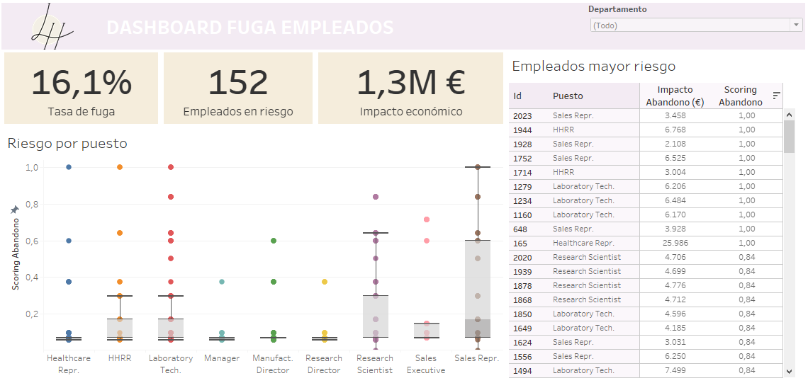

# Employee Attrition Prediction
**Description:**  
A comprehensive analysis of employee attrition within a company, designed to predict the risk of attrition, quantify its economic impact, and aid decision-making. Using **Data Science**, **Machine Learning**, and **Business Analytics** techniques, this project aims to provide actionable solutions to the talent retention problem.

## 📑 Table of Contents
- [1. Objectives](#-1-objectives)
- [2. Summary](#-2-summary)
- [3. Dashboard](#-3-dashboard)
- [4. Data Source and Structure](#%EF%B8%8F-4-data-source-and-structure)
- [5. Methodology](#-5-methodology)
- [6. Results](#-6-results)

---

## 🎯 1. Objectives
- **Quantify the attrition rate**: Analyze the extent of the employee turnover problem.
- **Predict at-risk employees**: Use machine learning models to identify employees with a high likelihood of leaving.
- **Measure economic impact**: Estimate the financial losses caused by employee attrition.
- **Strategic decision-making**: Provide actionable insights for HR teams to implement retention strategies.

---

## 📊 2. Summary

### Conclusions:
- **Predictive model**: A **Decision Tree model** achieved an **accuracy of 69%**, enabling reasonable predictions of attrition risks.
- **Economic impact**: Employee turnover costs were estimated at **$2,719,005** annually, with specific cost breakdowns by salary range.
- **High-risk profiles**: Employees with lower education levels, working in sales, earning lower salaries, and reporting high overtime workloads were more likely to leave.
- **Strategic insights**: Reducing turnover by **10%** could save approximately **$271,900** annually.

### Challenges faced:
- **Data quality issues**: Imbalanced and incomplete data required careful cleaning and preprocessing.
- **Feature selection**: Determining the most relevant variables significantly improved the model's predictive performance.

### Techniques applied:
- **EDA**: Explored categorical and numerical variables to identify trends and outliers.
- **Predictive modeling**: Built and trained machine learning models, including Decision Trees.
- **Business insights**: Quantified the economic impact of attrition and identified areas for cost savings.

### Programs used:
- **Python**: For data cleaning, analysis, and predictive modeling.
- **Tableau**: To create an interactive dashboard for HR managers.
- **Jupyter Notebooks**: For coding, documentation, and analysis.

### Future Work:
- Test additional machine learning models, such as **Random Forest** or **XGBoost**, to improve prediction accuracy.
- Integrate real-time predictions into HR systems for proactive decision-making.
- Conduct sentiment analysis of employee exit interviews to uncover further insights.

---

## 📈 3. Dashboard

Below is a screenshot of the Tableau dashboard, which visualizes attrition trends, predictions, and economic impact.
https://public.tableau.com/app/profile/luc.a.herrero.lvarez/viz/PrediccinFugaEmpleados/Dashboard1

---

## 🗂️ 4. Data Source and Structure

**Data Source:** The dataset is sourced from **DS4B** https://datascience4business.com/ and includes anonymized employee records. Key features include age, education, job role, salary, job satisfaction, and overtime hours.

### Key Tables:
- **abandono_empleados.csv**: Demographic and role-related information.

---

## 📝 5. Methodology

### Data Cleaning:
- **Categorical variables**: Imputed missing values with the most frequent categories (e.g., "High" job satisfaction).
- **Numerical variables**: Treated outliers and ensured proper formatting of numerical columns.
- **Dropped irrelevant columns**: Eliminated features with single unique values or little predictive value (e.g., "age_group").

### Exploratory Data Analysis (EDA):
- **Categorical insights**: Visualized employee characteristics (e.g., education level, marital status) using bar charts.
- **Numerical trends**: Analyzed salary distributions, overtime hours, and attrition-related metrics.

### Predictive Modeling:
- Trained a **Decision Tree Classifier** to predict the likelihood of employee attrition, achieving a **ROC-AUC score of 0.68**.
- Explored feature importance to identify the key drivers of attrition.

---

## 🏆 6. Results

The predictive model successfully identified high-risk employees and quantified attrition's economic impact.

- **Accuracy**: 69%
- **ROC-AUC score**: 0.68
- **Economic Savings Potential**: Reducing attrition by **10%, 20%, or 30%** could save **$271,900**, **$543,801**, or **$815,701**, respectively.

By leveraging these insights, companies can implement targeted strategies to improve employee retention and optimize HR operations.
